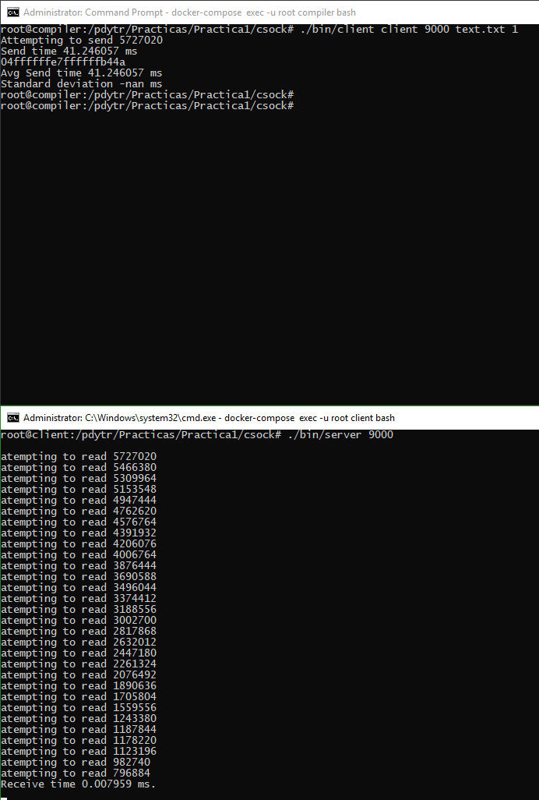

<h1><center>PDyTR 2018</center></h1>
<h1><center>Informe 1</center></h1>

</br></br></br></br></br></br></br></br></br></br></br></br></br></br></br></br></br></br></br></br></br></br></br></br></br></br></br></br></br></br></br></br></br></br></br></br>
### Integrantes:

#### Aparicio Natalia, Legajo 12667/7  

#### Eusebi Cirano, Legajo 12469/2  

#### [Repo](https://github.com/MagoDopado/pdytr2018)

</br></br></br></br></br></br>


#### 1 - Identifique similitudes y diferencias entre los sockets en C y en Java.

Similitudes

* Poseen características y funciones suficientes para cumplir el modelo de Cliente / Servidor.
* Ambos tienen el concepto de socket de espera y socket de emisión.
* Los sockets son siempre tanto de emisión como receción (full duplex)
* Se permite elegir el protocolo (TCP/UDP)
* La lectura funciona de la misma manera. Apenas llega algún dato al receptor, se libera (el buffer/stream) para continuar con la ejecución.


Diferencias

* Java hace uso de sockets de manera de alto nivel y C, en cambio, tiene funciones y manejos primitivos de sockets.
* El acceso al socket es a traves de un Stream en Java, y a traves de buffers en C.


#### 2 - Preguntas

**Inciso a) ¿Por qué puede decirse que los ejemplos no son representativos del modelo c/s?**  
En los ejemplos de la práctica podemos ver como se usan los sockets para una comunicación. El client que manda un mensaje y una vez mandado, termina la comunicación y el server que espera a recibir un mensaje, lo imprime y termina también.
Un modelo Cliente/Servidor tiene ciertas caracteristicas a cumplir:

Pasos de conexión:
  * Inicialización
  * Envió/recepción de peticiones
  * Finalización

_Características del Server_
  * Inicialmente pasivo (ejemplo: esperando una query )
  * Está escuchando (en algún puerto), listo para responder una petición por un client.
  * Al recibir una petición, la procesa y devuelve una response

_Características del Client_
  * Tiene un rol activo
  * Envía peticiones al Server
  * Al enviar una petición, espera la respuesta.

**Inciso b), c) y d)**  
Nos basamos en los archivos hechos en C para realizar los incisos de este punto.

Ambos tenemos conocimiento en C por haber realizado la materia Seminario de C y por haber tenido que usarlo en otras materias con un uso similar (Sistemas paralelos).

El approach que pensamos es con buffers de tamaño variable, utilizando punteros a char. Por esto, no nos encontramos con el problema de la limitación de un arreglo fijo/estático []. Según en el estándar C 99, la cantidad mínima en bytes con los que nos empezariamos a encontrar con problemas es de: 65,535 bytes.

**Inciso b)**  

Para compilar los archivos en la carpeta csock:
gcc clientFromFile.c -o bin/client -lm
gcc serverBigData.c -o bin/server

Para correr cada archivo:
./bin/client compiler 9000
./bin/server 9000

Leyendo la documentación de read y write en C pudimos encontrar la razón por la que lee de a partes del socket.
Ambas operaciones devuelven la cantidad leída/enviada, pudiendo ser  menor al count especificado. Esto no significa que hubo algún error sino que para un mejor manejo de memoria y de la aplicacion (performance) lee hasta una cantidad máxima (variable) de datos.  

Si la conexión fuese lenta, problemas de conectividad o algunos de los dos procesos fuera más lento, al intentar leer/escribir toda la cantidad deseada, podría bloquearse el proceso intentando realizar la operación o hasta "nunca" terminar. Entonces entendemos que al hacer la lectura/escritura de a batches, devuelve el control del proceso para decidir como continuar, teniendo como dato la cantidad de datos leídos/escritos.

Doc:  
  http://man7.org/linux/man-pages/man2/read.2.html  
  http://man7.org/linux/man-pages/man2/write.2.html


**Correcciones**
El cliente intenta enviar la totalidad del archivo, permitiendole al SO utilizar el tamaño de buffer que le parezca más adecuado para la situación. Luego el servidor observa la cantidad enviada a partir del valor de retorno de read y se ajustan los offsets y tamaño restante. De esta forma el buffer nunca se rompe.



Si se hace referencia al tamaño del buffer de envío del archivo, se utilizó memoria dinámica por lo que como se explicó más arriba no hubo problemas con el tamaño del buffer en la stack. El límite de tamaño de un arreglo en la stack es de  65,535 bytes.

**Inciso c)**  
Para la verificación de cantidad lo hacemos enviandole dos mensajes al servidor, el primero indicando la cantidad y en el segundo mensaje, la información.
Para la verificación de contenido, con la misma función definida en ambos procesos, utilizamos un checksum.

**Correcciones**  
El cliente envía 3 mensajes:
- El tamaño del payload a enviar.
- El payload.
- El checksum del payload.
Luego espera que el servidor le responda con el checksum.  
Mientras tanto, el servidor recibe los datos y va calculando su checksum, finalmente lo verifica con el enviado por el cliente y se lo manda de vuelta.
Ante una diferencia en la cantidad de datos o los datos en sí, el checksum es una de las opciones para verificar los datos, aunque no infalible.
La funcion de checksum utilizada fue adler32 y la implementación se buscó en wikipedia.


**Inciso D)**  
Usamos como tamaño de file 3, 4 y 6 MegaBytes de prueba. No utilizamos arhivos más pequeños porque es despreciable la diferencia entre sets de datos pequeñas.

tamaño | repeticiones | promedio | desviacion estandar
---|---|---|---
1M|500|5.0877 ms|0.1033 ms
5M|500|24.6126 ms|0.4398 ms
6M|500|29.4078 ms|0.4163 ms
10M|500|48.5726 ms|0.4725 ms
50M|100|243.5377 ms|1.7989 ms
100M|50|484.7031ms|0.8658 ms

**Correcciones**  
Se toma el tiempo con la función gettimeofday (ver MAN 2) que da presición de microsegundos.
El tiempo inicial se captura antes de la primer comunicación del cliente, luego de abierto el socket.
Se vuelve a tomar el tiempo luego de que el servidor envía el checksum correspondiente.
Se restan los valores obteniendo el delta y se guarda en un arreglo de tiempos para cada attempt.

Al finalizar todos los attempts se calcula average y standard deviation a partir de sus formulas.


Para generar los archivos basura se utilizó el comando
```bash
head -c 1M </dev/urandom > trash.txt
```

Reemplazando 1M por el tamaño de basura que se quiera.


#### 3 - ¿Por qué en C se puede usar la misma variable tanto para leer de teclado como para enviar por un socket? ¿Esto sería relevante para las aplicaciones c/s?
Ya que utilizamos para esta práctiva punteros a char para el buffer, no tiene más lógica que de estructura contenedora.
Consideramos que no es relevante para las aplicaciones c/s si es utilizado correctamente la memoria asignada.


#### 4 - ¿Podría implementar un servidor de archivos remotos utilizando sockets? Describa brevemente la interfaz y los detalles que considere más importantes del diseño.
Si se podría implementar.
Habría que configurar el cliente para que envíe el nombre del archivo al servidor y el servidor busca el archivo, lo abre y lo manda por red.


**Correcciones**  
Se podría implementar un servidor que acepte comandos (enumerativos) y argumentos
encodeados como `<opcode> 0x00 arg1 0x00 arg2 0x00 ...`

OpCode|Significado|Argumentos|Retorno|Ejemplo
---|---|---|---|---
01| LS | Path | N Entry1 Entry2 ... EntryN|`0x00 0x01 0x00 0x00 / 0x00` -> `0x00 0x02 0x00 0x00 . 0x00 i n d e x . h t m l 0x00`
02 | CD | Path | Success/Error | `0x00 0x02 0x00 0x00 . . 0x00` -> `0x00 0x01 0x00 0x00`
03 | Read | Path | Size Bytes Checksum | `0x00 0x03 0x00 0x00 i n d e x . h t m l 0x00` -> `0x00 0x05 0x00 0x00 1 2 3 4 5 0x00 0xF1 0xA1 0x0D 0xFE`
04 | Write | Path Size Bytes Checksum | Success/Error Checksum | `0x00 0x03 0x00 0x00 i n d e x . h t m l 0x00 1 2 3 4 5 0x00 0xF1 0xA1 0x0D 0xFE` -> `0x00 0x01 0x00 0x00 0xF1 0xA1 0x0D 0xFE`
05 | RM | Path | Success/Error | `0x00 0x05 0x00 0x00 i n d e x . h t m l 0x0¢0` -> `0x00 0x00 0x00 0x00`
06 | Close | n/a | 0 | `0x00 0x06 0x00 0x00` -> `0x00 0x00 0x00 0x00`

Si se quiere implementar el servidor de manera stateless, se pueden utilizar rutas absulutas en todos los comandos y deshabilitar el `CD`. Sino, se debe mantener una idea de sesión (se puede utilizar el socket como identificador y generador de la sesión) con la información del path actual.

Dado que la cantidad de operaciones es limitada, la lógica del servidor es bastante simple. Se lee 1 byte esperando el opcode y a partir de esto se determina la cantidad de argumentos (todos _null terminated_). Finalmente se hace la llamada al file system y se responde.
Se puede optimizar pre cacheando la estructura inicial del filesystem a servir e invalidarlo sólo en los writes/rm (se asume que el filesystem no cambiará de otra forma)

El servidor debe tener una ruta base de la cual no se puede escapar para preservar la integridad del SO.

Por simplicidad el servidor no explica los errores, pero se podría perfectamente generar una tabla de error codes similar a la de _gnu/linux_.

#### 5 - Defina qué es un servidor con estado (stateful server) y qué es un servidor sin estado (stateless server)  

-- **Statefull server**  
El servidor guarda algún estado (información) de un request a otro. De esta manera, el cliente puede mandar menos información por cada request. Este tipo de servidores suelen ser mas simples.

-- **Stateless server**  

El servidor no guarda el estado de ningún cliente, cada request es independiente de la previa. Normalmente los clientes de servidores sin estado de deben autenticar por cada request. Aunque requiera la una misma base de información por cada requests, es más robusto a perdidas de conexiones. Ante algún error, no invalida ningún archivo del servidor.
